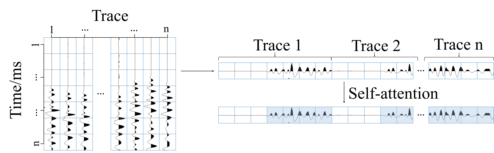

## Abstract

The application of neural networks to seismic first break (FB) picking research has been developed for many years. Numerous multitrace FB picking methods based on convolutional neural networks (CNNs) have been proposed. Among them, the pickup method of semantic segmentation networks based on fully convolutional networks (FCNs) is proven to have stronger noise immunity. However, when in the data with drastic variations in the FBs between local adjacent traces, because of the feature extraction method of FCNs for convergence information around the data, the network output feature edge tends to smooth, which leads to a flattening of the FBs of the multitrace pickup, which is not conducive to picking traces with drastic intertrace FB variations. Therefore, we use Transformer, a weight-transfer model that relies on the self-attention (SA) mechanism to calculate weights between input and output data, to extract FB features. The 2-D seismic data are flattened into a 1-D sequence along the time dimension of the trace and input to the network, and the spatial information of the FBs of the adjacent traces is considered without disrupting the time-series semantic information. The correlation between any element of the sequence and other elements is calculated to obtain the sequence feature weights. We use Swin Transformer as the backbone and combine the features of U-shaped networks to design an end-to-end FB picking network—STUNet. The results show that STUNet has higher FB picking accuracy than current FCNs and is more effective in local adjacent traces where the FB time variation is drastic.

## Paper

[Seismic First Break Picking Through Swin Transformer Feature Extraction](https://ieeexplore.ieee.org/document/10050858 )

## Feature extraction method



## Cite


### if this work is helpful for you, please cite

```
@ARTICLE{10050858,
  author={Jiang, Peifan and Deng, Fei and Wang, Xuben and Shuai, Pengfei and Luo, Wen and Tang, Yun},
  journal={IEEE Geoscience and Remote Sensing Letters}, 
  title={Seismic First Break Picking Through Swin Transformer Feature Extraction}, 
  year={2023},
  volume={20},
  number={},
  pages={1-5},
  keywords={Transformers;Feature extraction;Data models;Semantic segmentation;Convolution;Signal to noise ratio;Neural networks;First breaks (FBs) picking;neural networks;seismic first breaks;self-attention (SA);Swin Transformer},
  doi={10.1109/LGRS.2023.3248233}}


````

