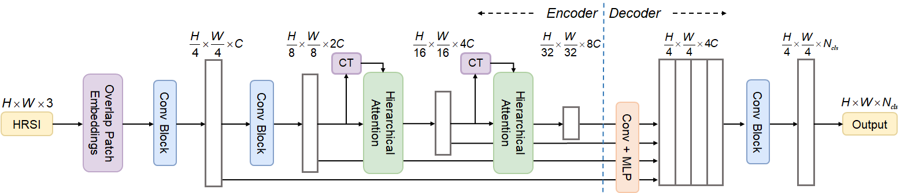

## Abstract

In recent years, convolutional neural networks (CNNs) and vision transformers (ViTs) have become the mainstream segmentation methods for high-resolution remote sensing images (HRSIs). CNNs can quickly acquire the correlation between local neighboring pixels through convolutional operations, but it is difficult to establish global contextual relationships, resulting in limited segmentation accuracy. ViTs are able to establish reliable global semantic dependencies through the mechanism of self-attention, but the quadratic computational complexity of self-attention makes the ViTs present high accuracy but low efficiency. Therefore, in this letter, to balance the efficiency and accuracy of HRSIs segmentation, we combine the respective advantages of CNNs and ViTs to propose the FSegNet network. Specifically, we introduce FasterViT and utilize its efficient hierarchical attention (HAT) to mitigate the surge in self-attention computation due to the high resolution of HRSIs. On this basis, we construct a lightweight decoder based on intensive computation, which achieves fast generation of segmentation results by reshaping and mapping multilevel features. Experiments on the ISPRS Potsdam and Vaihingen datasets show that the proposed FSegNet best balances performance and efficiency.

## Paper

[FSegNet: A Semantic Segmentation Network for High-Resolution Remote Sensing Images That Balances Efficiency and Performance](https://ieeexplore.ieee.org/document/10526302)

## Network


## Code

### The code is available at [here.](https://github.com/Rowan-L/FSegNet)

## Cite

### if this work is helpful for you, please cite

```
@ARTICLE{10526302,
  author={Luo, Wen and Deng, Fei and Jiang, Peifan and Dong, Xiujun and Zhang, Gulan},
  journal={IEEE Geoscience and Remote Sensing Letters}, 
  title={FSegNet: A Semantic Segmentation Network for High-Resolution Remote Sensing Images That Balances Efficiency and Performance}, 
  year={2024},
  volume={21},
  number={},
  pages={1-5},
  keywords={Feature extraction;Image segmentation;Decoding;Semantics;Convolution;Spatial resolution;Remote sensing;FasterViT;high-resolution remote sensing images (HRSIs);semantic segmentation},
  doi={10.1109/LGRS.2024.3398804}}


````

