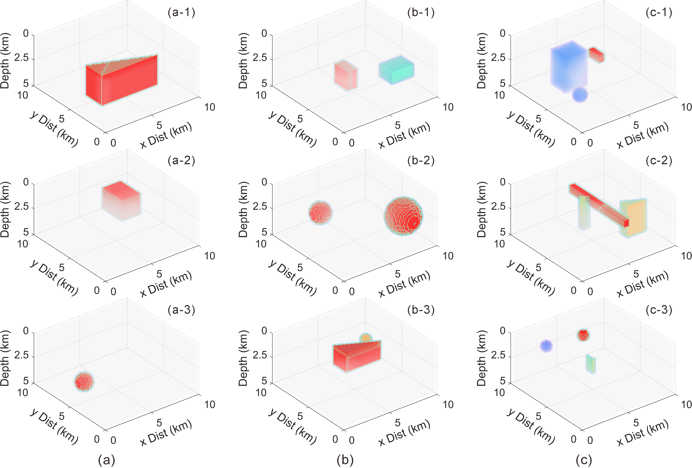

## Abstract

For a long time, the 2-D and 3-D Magnetotelluric (MT) forward modeling is mainly accomplished by computational methods. Traditional methods are time consuming due to the large amounts of discrete grids and slow solution of the matrix equation. Therefore, finding a fast forward modeling algorithm remains a major concern. In recent years, deep learning has provided new ways to accomplish this goal. Most existing deep learning-based MT forward modeling are performed on 2-D data, and there is a lack of research on the feasibility of 3-D problems. this paper constructs a large-scale 3-D MT dataset; employs a deep neural network suitable for 3-D MT data patterns, and improving the training efficiency through a transfer learning strategy for similar tasks, that can predict the apparent resistivity and phases in different polarization directions, and realizes fast and high-precision 3-D MT deep learning forward modeling. The experimental quantitative metrics show that the mean relative errors of apparent resistivity and phase are 0.6042% and 0.2423%, respectively, and the mean absolute errors are 1.6726 and 0.0994, respectively. When applying the method to geoelectric models that are more complex than the training set, accurate forward modeling results validate its generalization ability. The research may provide methodological and data support for larger-scale 3-D MT forward modeling in the future.

## Paper

[Three Dimensional Magnetotelluric Forward Modeling Through Deep Learning](https://ieeexplore.ieee.org/document/10530923)

## network


## Dataset

### The dataset is available at [here.](https://github.com/jiangpeifan/3D-MT-Dataset)

## Cite


### if this work is helpful for you, please cite

```
@ARTICLE{10530923,
  author={Wang, Xuben and Jiang, Peifan and Deng, Fei and Wang, Shuang and Yang, Rui and Yuan, Chongxin},
  journal={IEEE Transactions on Geoscience and Remote Sensing}, 
  title={Three Dimensional Magnetotelluric Forward Modeling Through Deep Learning}, 
  year={2024},
  volume={},
  number={},
  pages={1-1},
  keywords={Solid modeling;Deep learning;Computational modeling;Data models;Artificial neural networks;Transformers;Training;3-D Magnetotelluric (MT);Deep Learning Forward;Mean Relative Error;Geoelectric Models},
  doi={10.1109/TGRS.2024.3401587}}

````

