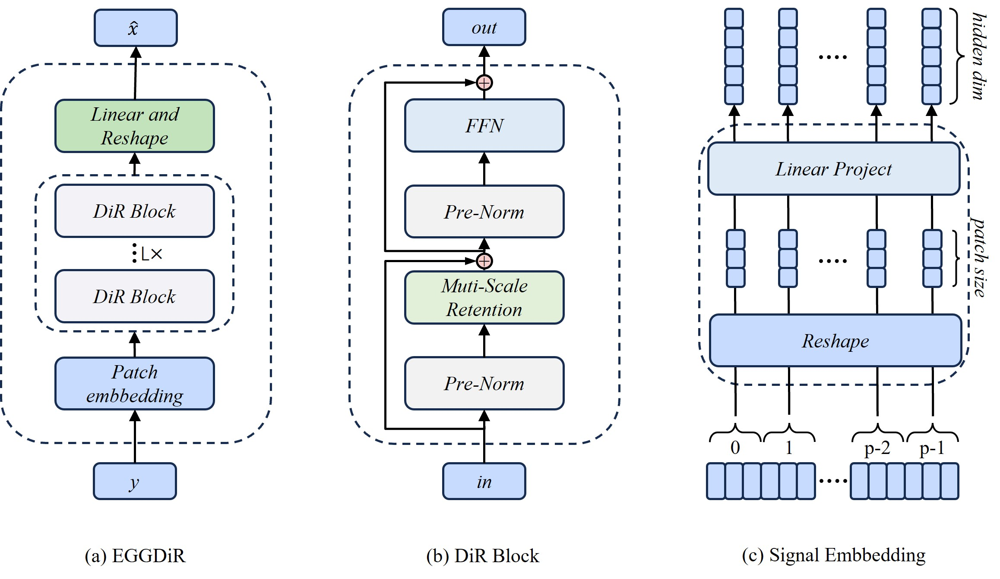

## Abstract

Electroencephalogram (EEG) signals play a pivotal role in clinical medicine, brain research, and neurological disease studies. However, susceptibility to various physiological and environmental artifacts introduces noise in recorded EEG data, impeding accurate analysis of underlying brain activity. Denoising techniques are crucial to mitigate this challenge. Recent advancements in deep learningbased approaches exhibit substantial potential for enhancing the signal-to-noise ratio of EEG data compared to traditional methods. In the realm of large-scale language models (LLMs), the Retentive Network (Retnet) infrastructure, prevalent for some models, demonstrates robust feature extraction and global modeling capabilities. Recognizing the temporal similarities between EEG signals and natural language, we introduce the Retnet from natural language processing to EEG denoising. This integration presents a novel approach to EEG denoising, opening avenues for a profound understanding of brain activities and accurate diagnosis of neurological diseases. Nonetheless, direct application of Retnet to EEG denoising is unfeasible due to the one-dimensional nature of EEG signals, while natural language processing deals with two-dimensional data. To facilitate Retnet application to EEG denoising, we propose the signal embedding method, transforming one-dimensional EEG signals into two dimensions for use as network inputs. Experimental results validate the substantial improvement in denoising effectiveness achieved by the proposed method.

## Paper

[EEGDiR: Electroencephalogram denoising network for temporal information storage and global modeling through Retentive Network](https://www.sciencedirect.com/science/article/abs/pii/S001048252400711X?via%3Dihub)

## Network



## Code

### The code is available at [here.](https://github.com/woldier/EEGDiR)

## Cite


### if this work is helpful for you, please cite

```
@article{WANG2024108626,
title = {EEGDiR: Electroencephalogram denoising network for temporal information storage and global modeling through Retentive Network},
journal = {Computers in Biology and Medicine},
volume = {177},
pages = {108626},
year = {2024},
issn = {0010-4825},
doi = {https://doi.org/10.1016/j.compbiomed.2024.108626},
url = {https://www.sciencedirect.com/science/article/pii/S001048252400711X},
author = {Bin Wang and Fei Deng and Peifan Jiang},
keywords = {Electroencephalogram (EEG) denoising, Retentive network, Deep learning, Signal embedding},
}
````

