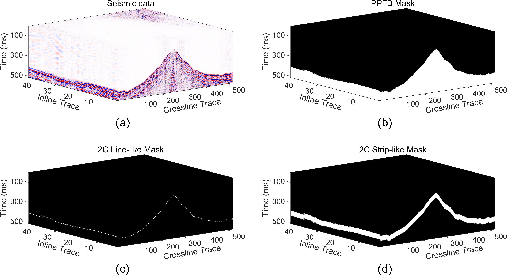

## Abstract

In recent years, much attention has been paid to using deep learning techniques for land seismic first break (FB) picking. Among these, the deep learning-based 3-D FB picking method has shown stronger noise resistance than the 2-D method, as it simultaneously considers the correlation of FBs in both crossline and inline directions. In existing studies, whether using 2-D or 3-D methods, they are often regarded as a binary semantic segmentation problem of pre- and post-first break (PPFB). The FB time is determined by dividing the image with a binary classification mask. However, due to the instability of the decision threshold setting of the PPFB mask strategy, different thresholds can cause different FB picking results. Considering this, we propose a two channel (2C) mask strategy that utilizes the feature interaction between a strip-like mask and a line-like mask to predict the confidence of FBs in seismic traces, thus realizing the FB picking with uniqueness. In addition, to enhance the global feature acquisition capability of the network, we construct a 3-D FB picking network USwinNet based on Swin Transformer, which establishes a larger receptive field through a multi-stage self-attention mechanism. Experimental results demonstrate that our method significantly improves the picking accuracy compared to existing methods. It also exhibits strong generalization capabilities, making it more suitable for practical engineering under complex geological conditions.

## Paper

[3-D Seismic First Break Picking Based on Two Channel Mask Strategy]( )

## Mask Strategy



## Code

### The code is available at [here.](https://github.com/jiangpeifan/2C-SeismicFBpicking)

## Cite


### if this work is helpful for you, please cite

```
Accepted
````

