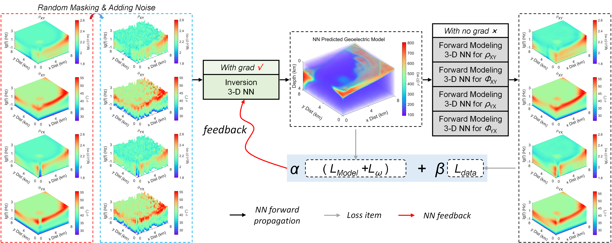

## Abstract

Magnetotelluric deep learning (DL) inversion methods based on joint data-driven and physics-driven have become a hot topic in recent years. When mapping observation data (or forward modeling data) to the resistivity model using neural networks (NNs), incorporating the error (loss) term of the inversion resistivity's forward modeling response--which introduces physical information about electromagnetic field propagation--can significantly enhance the inversion accuracy. To efficiently achieve data-physical dual-driven MT deep learning inversion for large-scale 3-D MT data, we propose using DL forward modeling networks to compute this portion of the loss. This approach introduces pseudo-physical information through the forward modeling of NN simulation, further guiding the inversion network fitting. Specifically, we first pre-train the forward modeling networks as fixed forward modeling operators, then transfer and integrate them into the inversion network training, and finally optimize the inversion network by minimizing the multinomial loss. Theoretical experimental results indicate that despite some simulation errors in DL forward modeling, the introduced pseudo-physical information still enhances inversion accuracy and significantly mitigates the overfitting problem during training. Additionally, we propose a new input mode that involves masking and adding noise to the data, simulating the field data environment of 3-D MT inversion, thereby making the method more flexible and effective for practical applications.
## Paper

[3-D magnetotelluric deep learning inversion guided by Pseudo-Physical information](https://arxiv.org/abs/2410.09388)

## Network Training Process



## Cite


### if this work is helpful for you, please cite

```

````

